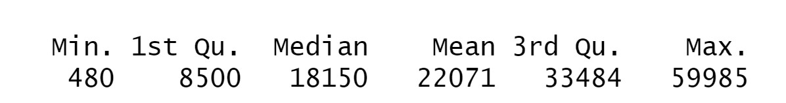

```{r setup, include=FALSE}
knitr::opts_chunk$set(echo = TRUE)
```

## Learning Objectives

### Statistical Learning Objectives
1. Brief review of probability
2. Summarizing and visualizing categorical data 
3. Summarizing quantitative data

### R Learning Objectives
1. Review the functions covered in Lab 1
2. Create tables
3. Create three different types of bar charts

### Functions covered in this lab
1. `read.csv()`, `head()`, `str()`
2. `table()`
3. `barplot()`

***

## Lab Tutorial

### Lab 1 Review

In Lab 1, we learned about RStudio and got started writing R code. We learned how to use R as a calculator, how to store values and data, and how to read in and preview a data set. Let's go through a quick refresher. 

By itself, the `read.csv()` function reads in a data set. By using a left facing arrow (`<-`) we can assign this data set a name. Let's read in the `penguins.csv` data set and store it as `penguins`. Remember, clicking on the green play button will run the code chunk.

```{r readData}
penguins <- read.csv("penguins.csv")
```

We also learned a few ways to preview the data. We can use the `head()` function to display the first few rows. By default, this function outputs the first six rows. We can include an extra argument (`n`) to specify the number of rows. 

```{r headFunction}
head(penguins, n = 4)
```

We can use the `str()` function (pronounced "stir") to get a short description of the data set and its variables.

```{r strFunction}
str(penguins)
```

Finally, we learned that R can be a little picky. 

- Every code chunk must start and stop with **three** backticks -- including fewer or more backticks will lead to errors.  
- Every chunk must have a unique chunk name
- To reference a stored value, variable, or data set, we must type in the ***exact*** name

If you have any questions about Lab 1, now is a great time to ask! If not, let's learn some new functions.  


### Frequency Tables

Categorical variables can be summarized through frequency tables using the `table()` function. These tables count the number of observations that fall into each group (or category) for a specific variable. In order to select a *specific* variable within a data set, we must use the following code structure:

`dataset$variable`

This is how we tell R to use a specific variable of interest from our data set. So if we want to create a frequency table for the `species` variable, we would use the following code:

```{r table}
table(penguins$species)
```

From this output, we can see that there are 119 Gentoo penguins in the data set.

It is very important to include the data set when referencing the variable. Let's see what happens when we don't:

```{r noDollarSign, error = T}
table(species)
```

Because we don't have anything stored as `species`, R doesn't know what we're talking about! The variable `species` only exists *inside* of the `penguins` data set.

**Demo #1**: Create a frequency table for the `island` variable in the `penguins` data set. Remember, the structure should be `dataset$variable` inside the parentheses. 

```{r demo1, error = T}
# Replace this comment with your code

```

**Question:** What proportion of penguins are found in Biscoe island?  


We can also make "two-way" frequency tables (sometimes called "contingency tables") to summarize counts for two categorical variables. Let's make a contingency table using the `species` and `island` variables.

```{r twoWayTable}
table(penguins$species, penguins$island)
```

We can see that all of the Gentoo penguins in our data set live on Biscoe island.

Note: whichever variable is provided first will give you the rows of your table. The second variable will give you the columns. It's always row variable, then column variable.

Note: we separated the two variables inside of `table()` with a comma -- it's important to remember this! Every argument inside of a function must be separated with a comma.

Finally, another helpful function for working with tables is the `addmargins()` function. If you copy the code from our last chunk and paste it inside the `addmargins()` function, R will include the row and column totals as well. Check it out below!

```{r tableTotals}
addmargins(table(penguins$species, penguins$island))
```

This additional information can be helpful when calculating proportions or probabilities.

Note: copying and pasting a function *inside* of another function is called "nesting".


### Bar Charts (or Bar Plots)

#### Bar Charts for a Single Categorical Variable

To visualize categorical variables, we can use bar charts (also known as bar plots or bar graphs). To create one in R, we "nest" the `table()` function inside of the `barplot()` function. Check it out!

```{r speciesBarPlot1}
barplot(table(penguins$species))
```

This bar chart looks pretty basic -- it's missing labels and a title. In order to add these features to the plot, we simply include more arguments. Remember, each argument must be separated by a comma. Sometimes all of this text can look busy on one line so it can be helpful to put each argument on a new line. Let's see what a more complete bar chart looks like. *Be careful with parentheses!*

```{r speciesBarPlot2}
barplot(table(penguins$species),
        xlab = "Species",
        ylab = "Frequency",
        main = "Bar Chart of Penguin Species",
        col = c("darkorange1", "mediumorchid2", "darkcyan"))
```

In the code above, we utilized the following arguments:

- `xlab`: x-axis label
- `ylab`: y-axis label
- `main`: main plot title
- `col`: color for each group/category

**Demo #2**: Make a bar chart for the number of penguins on each island (using the `island` variable). Feel free to copy, paste, and edit the code from the `speciesBarPlot2` chunk, but be sure to change the x-axis label and title! 

**Coding Challenge:**  Add color to your bar chart and use different colors than the three used above.  Feel free to ask Google! 

```{r demo2, error = T}
# Replace this comment with your code

```

Did you get any errors? If not, well done! If you did, double check that each argument is separated by a comma. Don't be afraid to ask your GSI for help!

**Question:** If your friend wants to see penguins, which island do you recommend they visit? 


#### Grouped Bar Charts for Two Categorical Variables

Often times, graphically displaying a single variable is not enough to explore the data.  Instead, we often want to plot two variables simultaneously.  To visualize proportions of a categorical variable across various groups from a second categorical variable, we we "nest" the `table()` function inside of the `barplot()` function. Notice that the table is a "two-way" frequency table. 

```{r groupedplot}
barplot(table(penguins$species, penguins$island), 
        beside = TRUE)
```
This bar chart looks pretty basic -- it's missing labels, a title, and a legend. In order to add these features to the plot, we simply include more arguments. Remember, each argument must be separated by a comma, and *be careful with parentheses!*

```{r groupedplot2}
barplot(table(penguins$species, penguins$island), 
        beside = TRUE, 
        xlab = "Island",
        ylab = "Frequency",
        main = "Grouped Bar Chart of Penguin Species Found per Island",
        legend.text = rownames(table(penguins$species, penguins$island))
        )
```

In the code above, we utilized the following two *new* arguments:

- `beside`: grouped bars
- `legend.text`: legend

Notice that in the previous code chunk, we are refering to the table twice.  One way to make the code look cleaner is to *store the table results* by assigning it a name. 

```{r groupedplot3}
two_way<- table(penguins$species, penguins$island)
barplot(two_way, 
        beside = TRUE, 
        xlab = "Island",
        ylab = "Frequency",
        main = "Grouped Bar Chart of Penguin Species Found per Island",
        legend.text = rownames(two_way)
        )
```

Notice that the two previous grouped bar charts are the same; we highlighted two ways of producing the same results. 


**Demo #3**: Make a grouped bar chart displaying the sex of the penguins per species. Feel free to copy, paste, and edit the code from the `groupedplot3` or `groupedplot3` chunk, but be sure to change the variables, x-axis label and title! 

**Coding Challenge:**  Add some color to your grouped bar chart! 

```{r demo3, error = T}
# Replace this comment with your code

```

**Question:** Is there an even representation of female and male penguins across the three different species? 

#### Stacked Bar Charts for Two Categorical Variable 

A stacked bar chart is like a grouped bar graph, but the frequency of the categorical variables are stacked.  This type of bar plot will be created by default when passing as an argument a two-way table of two categorical variables, as the argument `beside` defaults to `FALSE`. 

```{r stackedplot, error = T}
# Replace this comment with your code
two_way<- table(penguins$species, penguins$island)
barplot(two_way, 
        beside = FALSE, 
        xlab = "Island",
        ylab = "Frequency",
        main = "Stacked Bar Chart of Penguin Species Found per Island",
        legend.text = rownames(two_way),
        col = c("cyan", "magenta", "yellow")
        )
```

That's all we've got for today -- we will learn how to visualize and summarize quantitative variables in Lab 3!

***

## Try It!

Complete the following exercises. Remember, the "Lab Tutorial" and Try It" questions will be graded for **completeness**. Be sure to give *every* question your best shot! We strongly encourage you to form small groups and work together. 

In this Try It, we will be using a data set called `tuition` that contains information about cost of attendance for 1,861 colleges and universities around the United States.

> **1.** Start by reading in the data by running the code chunk below. Note: you do not have to report anything for an answer.

```{r tryIt1, error = T}
tuition <- read.csv("tuition.csv")
```


> **2.** Use the `head()` or `str()` function to determine how many variables are in the data set. Report the number of variables below the code chunk. Note: you do not have to list the variable names. 

```{r tryIt2, error = T}
# Replace this text with your code!

```

*Answer:* Replace this text with your answer.


> **3.** Create a bar chart for the variable `type`. Be sure to give your plot an appropriate title and labels. Remember, you can check out the `speciesBarPlot2` code chunk from earlier for help! Remember to add color to your plots and be adventurous with your color options! 

```{r tryIt3, error = T}
# Replace this text with your code!

```


> **4.** Create a two-way frequency table of the variables `degree_length` and `type`. Remember, you can include row and column totals by using the `addmargins()` function. Report the number of "Public" schools below the code chunk.

```{r tryIt4, error = T}
# Replace this text with your code!

```

*Answer:* Replace this text with your answer.


> **5.** Create a grouped bar chart that shows the distribution of `type` of institution based on the `degree_length`.  Don't forget to include an appropriate title, x-axis label, legend and color.  Write a 1-2 sentence summary of your plot below the code chunk.  

```{r tryIt5, error = T}
# Replace this text with your code!

```

*Answer:* Replace this text with your answer.


***


## Dive Deeper

Complete the following questions. Remember, the "Dive Deeper" questions will involve analyzing the results and will be graded for **correctness**. If you have any questions, please ask for help (in lab, in office hours, or on Piazza)!

> **1.** Based on your two-way frequency table from Try It 4, answer the following question: Are the events "a randomly selected school will be **Public**" and "a randomly selected school will be a **4 Year** school" **mutually exclusive**? Briefly explain your reasoning, providing numerical support.  

*Answer:* Replace this text with your answer.


> **2.** Below you will find six numerical summaries for the variable `in_state_tuition`.  

Based on the numerical summaries, answer the following question: Would you expect the distribution of in state tuitions to be skewed left, skewed right, or symmetric? Briefly explain your reasoning, providing numerical support.   

*Answer:* Replace this text with your answer.


***


## Submission Instructions

Carefully follow the instructions below to submit your work.

1. At the top of this document, change the `author` field to your name (in quotes!).

2. Click the **Knit** button one last time.

3.  In the Files pane (the bottom right window), check the box next to "lab02report.html".

4. Click More > Export... 

5. Leave the name of the file as "lab02report.html". **Do not change the file name.** Click Download and save the file to your computer.  

6.  On the Stats 250 Canvas site, click the "Assignments" panel on the left side of the page. Scroll to find "Lab 2", and open the assignment. Click "Start Assignment". 

7.  At the bottom of the page, upload your saved "lab02report.html" file. 

8.  Click "Submit Assignment". 


